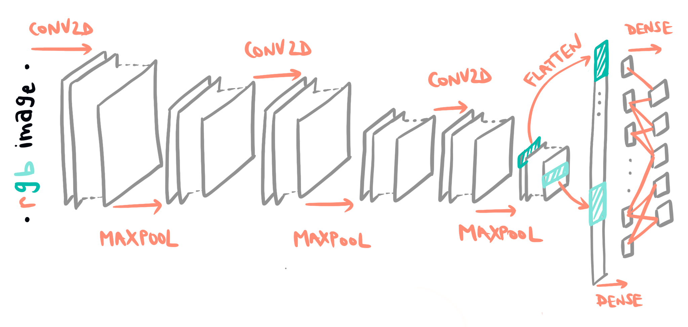
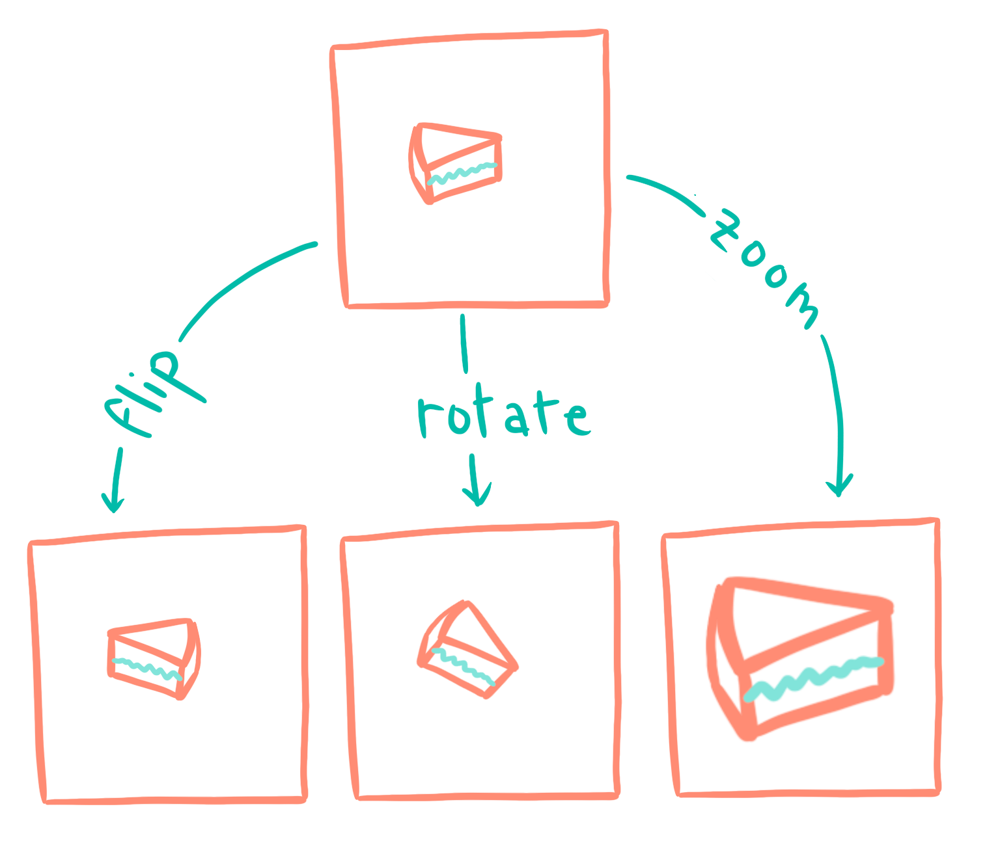

<!--**bold**
    *italics*
    ## headline
    ### subheadline
    #### subsubheadline -->

## The main idea
&nbsp;&nbsp;&nbsp; As a French person, I love myself a good cheese board at a restaurant. And from time to time, one cheese out of the selection is just celestial. In that case, I want to know what cheese it is - and to keep its info, to treat myself sometime in the future. I could just ask the restaurant personnel - right? Or, develop my own app so that if I take a picture of a delicious piece of cheese, the app tells me exactly what it is - kind of when you want to know what a piece of music is and you use Shazam.

*Note: this was a school project conducted at IIT, but to be honest, I love the idea so much that I will probably improve this project over time and maybe develop an actual app in the future. I'll post any update here!*

___

## The dataset
&nbsp;&nbsp;&nbsp;The dataset is a <u>custom-made</u> dataset from images scraped from Google Images. 
### Scraping the images from Google
&nbsp;&nbsp;&nbsp; The images have been scraped from Google Image with the help of Python module <a href = "https://github.com/hardikvasa/google-images-download" target = "_blank">google_images_download</a> using queries whose keywords corresponded to the cheeses I wanted to include. In the state of things, the dataset comprises:
- <u>Beaufort</u> · 403 images
- Mozzarella · 288 images
- <u>Comté</u> · 441 images
- Morbier ·347 images
- Bleu d'Auvergne · 386 images

&nbsp;&nbsp;&nbsp;Unfortunately, at the time of this project, Google Images did not allow more than 400 images to be scraped at once - always taken from the top of the Google Images query, so multiple queries under the same keywords yielded identical images. 
Note that Beaufort and Comté are highlighted in the above list - because they're very similar looking cheeses (look it up - by just looking at them, it's hard to tell them apart). In fact, I chose those two because of that characteristic - I wanted to assess my classifier's performance on a dataset with all different cheeses and see if including a cheese that's similar to another changed the metrics. 
### Data augmentation
&nbsp;&nbsp;&nbsp;A few hundreds of images per cheese seemed too few to train a classifier - so I used data augmentation techniques to inflate my dataset. The images were subjected to:
- Random flip
- Random rotations
- Random zoom
Those operations were performed using TensorFlow Keras' <a href = "https://www.tensorflow.org/api_docs/python/tf/keras/layers/experimental/preprocessing" target="_blank">preprocessing functions</a>. 
___

## Classifier architectures
&nbsp;&nbsp;&nbsp;Multiple classifier architectures were used to train models and confront the results. 
### Base model
&nbsp;&nbsp;&nbsp;The base model has the following architecture:

| **Layer** | &nbsp;&nbsp;&nbsp; **Output Shape** &nbsp;&nbsp;&nbsp;| **Activation** |
| :-------- | :--------------: | -------------: | 
| Rescaling | 256·256·3  | · |
| Conv2D | 256·256·32 | ReLu |
| MaxPooling | 128·128·32 | · |
| Conv2D | 128·128·32 | ReLu |
| MaxPooling | 64·64·32 | · |
| Conv2D | 64·64·32 | ReLu |
| MaxPooling | 32·32·32 | · |
| Flatten | 32768 | · |
| Dense | 128 | ReLu |
| Dense | 5 | Softmax |

&nbsp;&nbsp;&nbsp;Schematically, all the layers (omitting the rescaling layer) are represented on the following sktech:

&nbsp;&nbsp;&nbsp;The rescaling layer is only there because the initial images are RGB images with different sizes - but they all need to be the same shape (256·256·3) once fed as input to the classifier.

### Base model with dropout
&nbsp;&nbsp;&nbsp;The base model is used, but with a few tweaks. Dropout layers are added after the second and third convolutional layers. These dropout layers randomly set inputs to 0 <u>with a frequency of 0.4</u> (during training only). This helps avoiding the overfitting of our model - *i.e.* it prevents the model from picking up too many details from the training data that may not be generalizable. 

### Base model with dropout and data augmentation
&nbsp;&nbsp;&nbsp;Here once again, the base model is incremented with three new layers: <u>RandomFlip</u>, <u>RandomRotation</u> and <u>RandomZoom</u> , with parameters <u>'horizontal'</u>, <u>0.1</u> and <u>0.1</u> respectfully. Those layers are placed right after the resizing layer, and before the first convolution. This layer will provide artificial new images, by messing a bit with the images from the initial dataset. This way, the network is more robust to changes in size or in orientation of the cheeses. The operations performed can be visualized on the figure below - the rotate and zoom operations have been exaggerated for convenience: 

### VGG-16 with dropout and data augmentation
&nbsp;&nbsp;&nbsp;[MORE TO COME]
___
## Classification results
&nbsp;&nbsp;&nbsp;[MORE TO COME]
___

## Future work
### Adding this project to GitHub
&nbsp;&nbsp;&nbsp;Since this is was a school project, I have everything offline on my PC. I am currently in the process of adapting everything to post on my GitHub page, so that you can try it yourself if you want. Stay tuned!
[MORE TO COME]

### More cheeses 
&nbsp;&nbsp;&nbsp;The idea is to be able to classify most cheeses from pictures - and there are a LOT of them. But this requires me to build a dataset, and in the state of things, will be difficult. Not only the number of images I can get from Google Images is limited to a few hundreds per cheese type, but some cheeses may be underdocumented. Also, the neural network will need to be tweaked a little to accomodate the high number of labels. 

### An app?
&nbsp;&nbsp;&nbsp;The end goal for this project is to build an actual application to be used on phones, to classify cheeses on the fly (*i.e* when you are at a restaurant and want to know what kind of cheese is in your platter). This is 100% doable, but an issue to keep in mind is that <u>cheeses on cheese platters are often cut in small slices</u> - which means I probaly should use a dataset of sliced cheeses to train my classifier. However, this might be more challenging than classifying whole cheeses or bigger slices. In the end, all hinges on choosing the proper way to build the dataset. 

